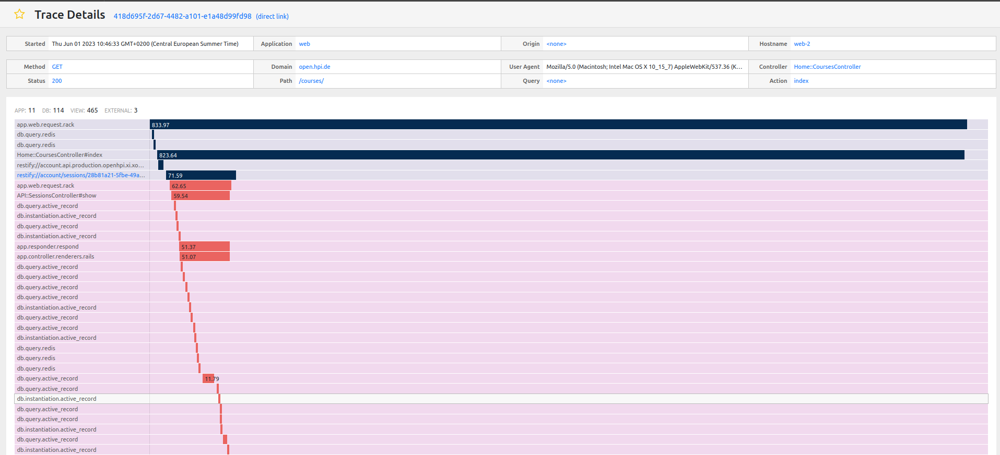
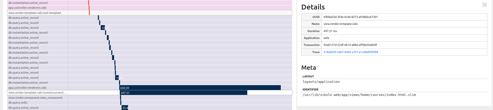

# Code smells

## What is a code smell?

First coined by Kent Beck, as the term "code smell" implies, they are easily spottable and sniffable "surface
indications that usually correspond to a deeper problem in the system" (Martin Fowler).

Smelly code is generally a mess and thus:

- hard to understand,
- hard to maintain,
- too verbose,
- unbalanced (e.g., no methods/functions at all or the opposite: way too many methods/functions for every single thing that is done),
- not tested or hard to test.

> “Most code is a mess. Most new requirements change existing code. Ergo, much of our work involves altering imperfect code.” (Sandi Metz)

## Why do we need to know about them?

In their book “Refactoring”, Martin Fowler and Kent Beck named 22 identifiable patterns as code smells.
5 macro-categories for these patterns were later identified by Mika Mäntylä to make them easier to understand and
recognize. Do we have to know by heart all of these names? No, but as Sandi Metz says, having a precise label for each
code smell makes it easy for us to identify them and talk about them without miscommunications.
Getting to know them is the first necessary step to improve the performance, testability, and security of your codebase
and further reduce its technical debt.

Expand the macro-categories sections to see the related code smells:

<details markdown>
  <summary>Bloaters represent something that has grown so large that it cannot be effectively handled.</summary>

- **Long Method** is a method that is too long, so it is difficult to understand, change,
    or extend. Fowler and Beck (Fowler & Beck 2000) strongly believe in short methods.

- **Large Class** means that a class is trying to do too much. These classes have too
    many instance variables or methods.

- **Primitive Obsession** smell represents a case where primitives are used instead of
    small classes. For example, to represent money, programmers use primitives rather
    than creating a separate class that could encapsulate the necessary functionality like
    currency conversion.

- **Long Parameter List** is a parameter list that is too long and thus difficult to understand.

- **Data Clumps** smell means that software has data items that often appear together.
    Removing one of the group’s data items means that those items that are left
    make no sense, e.g., integers specifying RGB colors.

</details>

<details markdown>
  <summary>Object-Orientation Abusers represent cases where the solution does not fully exploit the possibilities of object-
  oriented design.</summary>

- **Switch Statements** smell has a slightly misleading name since a switch operator
    does not necessarily imply a smell. The smell means a case where type codes or
    runtime class type detection is used instead of polymorphism. Also type codes
    passed on methods is an instance of this smell.

- **Temporary Field** smell means that the class has a variable which is only used in some
    situations.

- **Refused Bequest** smell means that a child class does not fully support all the
    methods or data it inherits. A bad case of this smell exists when the class is refusing
    to implement an interface.

- **Alternative Classes** with Different Interfaces** smell means a case where a class
    can operate with two alternative classes, but the interface to these alternative classes
    is different. For example, a class can operate with a ball or a rectangle class, and if it
    operates with the ball, it calls the method of the ball class playBall() and with the
    rectangle it calls playRectangle().

</details>

<details markdown>
  <summary>Change Preventers has to be refactored to make the software more modifiable.</summary>

- **Divergent Change** smell means that one class needs to be continuously changed
    for different reasons, e.g., we have to modify the same class whenever we change a
    database, or add a new calculation formula.

- **Shotgun Surgery** smell is the opposite to the Divergent Change. It means that for
    every small change we must modify a bunch of classes, e.g., whenever we change a
    database we must change several classes.

- **Parallel Inheritance Hierarchies** smell means a situation, where two parallel class
    hierarchies exist and both of these hierarchies must be extended.

</details>

<details markdown>
  <summary>Dispensables all represent something unnecessary that should be removed from the source code.</summary>

- **Lazy Class** is a class that is not doing enough and should therefore be removed.

- **Data Class** is a class that contains data, but hardly any logic for it. This is bad since
    classes should contain both data and logic.

- **Duplicate code**: According to Fowler and Beck (Fowler & Beck 2000), redundant
    code is the worst smell. We should remove duplicate code whenever we see it, because it means we have to do
    everything more than once.

- **Speculative Generality** smell is a case, where unnecessary code has been created
    in anticipating the future changes of  the software. Predicting the future can be difficult and often this just adds
    unneeded complexity to the software.

</details>

<details markdown>
  <summary>Couplers are about bad data communication mechanisms, bad encapsulation and/or high coupling.</summary>

- **Message Chains** smell means a case, where a class asks an object from another
    object, which then asks another and so on. The problem here is that the first class
    will be coupled with the whole class structure. To reduce this coupling, a middleman
    can be used.

- **Middle Man** smell means that a class is delegating most of its tasks to subsequent
    classes. Although this is a common pattern in OOP, it can hinder the
    program, if there is too much delegation. The problem here is that every time you
    need to create new methods or modify the old ones, you also have to add or
    modify the delegating method.

  - Message Chains and Middle Man are somewhat opposite, meaning that decreasing one smell will cause the other to
      increase.
  - Removing the Message Chains smell does not always cause the Middle Man smell and vice
      versa, since the best solution is often to restructure the class hierarchy by moving methods
      or adding subclasses.

- **Feature Envy** smell means that a method is more interested in other class(es) than
    the one where it is currently located. This method is in the wrong place since it is
    more tightly coupled to the other class than to the one where it is currently located.

- **Inappropriate Intimacy** means a smell where two classes are too tightly coupled
    with each other. As Fowler and Beck (Fowler & Beck 2000) put it, classes spend too
    much time delving in each other’s private parts.

</details>

<details markdown>
  <summary>Others</summary>

- **Incomplete Library Class** smell means that the software in question is utilizing
    a library that is not complete. This means that developers have to extend the functionality of the library.

- **Comments** are not necessarily a bad smell, but they can be misused to compensate
    for poorly structured code.

</details>

A codebase full of code smells is most likely one that is difficult to change.
A famous quote by Kent Beck goes as follows:

> “For each desired change, make the change easy (warning: this may be hard), then make the easy change."

This means: **Organize and structure your code so that it is easy to change it.**
Furthermore, it's important to pay special attention to those parts of the code that are clearly breaking the long-tested good practices established with the label of “Clean Code”.

## What is Clean Code?

This term was first introduced by Robert C. Martin (‘Uncle Bob’) in his milestone book _Clean Code_.
It is a collection of best practices in Object-oriented programming (OOP) / Object-oriented design (OOD) for achieving code that is easy to understand, testable, modifiable, and safe to deploy.
This book is a must-read for software engineers as it introduces the fundamental principles of OOD and SOLID.

|     |                                     |                                                                         |
|-----|-------------------------------------|-------------------------------------------------------------------------|
|**S**RP |The Single Responsibility Principle | A class should have one, and only one, reason to change.                |
|**O**CP |The Open Closed Principle | You should be able to extend a class's behaviour, without modifying it. |
|**L**SP |The Liskov Substitution Principle | Derived classes must be substitutable for their base classes.           |
|**I**SP |The Interface Segregation Principle | Make fine-grained interfaces that are client specific.                  |
|**D**IP |The Dependency Inversion Principle | Depend on abstractions, not on concretions.                             |

Source: [Uncle Bob’s blog](http://www.butunclebob.com/ArticleS.UncleBob.PrinciplesOfOod).

### Some other useful principles

- **DRY** : Do not repeat yourself. Useful for cleaning up excessive duplication.
- **KISS**: Keep it simple. Do not add layers of complexity or overkilling logic - useful against _Speculative Generality_ code smell, for instance.
- **YAGNI**: You ain't gonna need it. Do you need now this piece of code right now? Or is it just another speculative generality code smell?
- **Law of Demeter**: Each unit should have only limited knowledge about other units and talk only to its "friends", ie. immediate objects. We can see the abuse of this rule in the message chain code smell, for instance.
- **Principle of Least astonishment**: It proposes that a component of a system should behave in a way that most users will expect it to behave, and therefore not astonish or surprise users.

## What are the most common code smells in Ruby on Rails?

Some of the most common code smells in Ruby on Rails are:

- **Too much logic in views**: Putting ActiveRecord stuff, models, chained scopes or methods, breaking the Law of Demeter or even more complex logic involving backend or persistence layer breaks clean code solid principle of SR and the OOP principles of abstraction and encapsulation, as in the _message chain_ code smell.
- **Bloated controllers**: Controllers should be responsible for handling HTTP requests. Suppose they get bloated with logic that serves other purposes than that. In that case, it might be that they are taking on tasks that should be instead performed by other types of classes, i.e. models for the persistence layer, or services for external API calls.
- **Bad performance of queries**: Badly written database queries, like the infamous N+1 queries, for instance.
- **Too much magic**: This breaks the principle of least astonishment.
- And again, **not following SOLID principles**.

### How to identify code smells?

Nothing is like taking extra care to produce virtuous code while coding.
But huge codebases also contain code that we are not familiar with and it might be really challenging to find code smells there.
Luckily, we can also rely on automation and monitoring tools, such as Rubocop, Sentry, and Mnemosyne.

#### Rubocop

In this example, Rubocop complains about the code smell of using instance variables in helpers:

```ruby
  # app/helpers/course_context_helper.rb
  def custom_course_css
    return unless ['course/courses', 'items'].include?(params['controller'])
    return unless %w[show index].include?(params['action'])
    return unless Xikolo.config.course_codes_with_custom_css.include?(the_course.course_code)

    @custom_course_css ||= the_course.course_code

```

```ruby
    rubocop app/helpers/course_context_helper.rb
    Inspecting 1 file
    C

    Offenses:

    app/helpers/course_context_helper.rb:61:5: C: Rails/HelperInstanceVariable: Do not use instance variables in helpers.
        @custom_course_css = the_course.course_code
        ^^^^^^^^^^^^^^^^^^

    1 file inspected, 1 offense detected
```

An instance variable in a helper is considered a code smell.
Since it can be used in any controller where a helper can get mixed in, it skips common boundaries that are in place to organize code and decouple logic.
Instance variables in helpers and class / global variables can be considered as a manifestation of the global state. Therefore, they break the OOP principle of abstraction, and the SOLID principles, making tests harder and behaviour unpredictable.

Furthermore, Rubocop's [cop documentation](https://docs.rubocop.org/rubocop/cops.html) provides a useful resource for learning current best practices in Ruby and Rails.

#### Mnemosyne



In this trace, some 'bottlenecks' are evident.
After the first bottleneck of the `Home::CoursesController#index`, which may be yet understandable because of the particular database queries used there, an interesting bottleneck for us can be found immediately below in the `home/courses/index.html.slim` view, which shows a slow performance.

Indeed, we can find quite a lot of logic in this view, and even nested conditionals:

```ruby
  - if @categories.any? <--- CONDITIONAL
    - if @featured_course <--- NESTED CONDITIONAL
      # ...

    - @categories.each_with_index do |category, index| <--- LOOP
        - if category.callout.present? <--- NESTED CONDITIONAL FOR EACH LOOPED ITEM
          # ...

        - if category.courses.respond_to?(:next_page) && category.courses.next_page.present? <--- NESTED CONDITIONAL FOR EACH LOOPED ITEM
          # ...
  - else
    - if @filtered_list <--- NESTED CONDITIONAL
        # ...
    - else
      # ...
```

All this accounts for the Rails-specific code smell of views bloated with logic that contributes to the degraded performance of the page.

## Refactoring

If you find a code smell in your codebase, it is advisable to refactor it into a virtuous, clean code.
_Leaving the place cleaner than you found it_ is a generally advisable code of conduct in this case.

By refactoring, we mean “changing the way the code is structured, so that it is more performant, easier to test, more understandable, without changing its behaviour and result”.

As a rule of thumb, you should aim for tests before refactoring code. Otherwise, how do you know if the code you are changing is behaving correctly as before?
Test-driven development (TDD) may help to correct code smells if there is no available test.
In his book _Refactoring_, Martin Fowler indicates refactoring best practices for each code smell category.

## Further reading

If you are not familiar with OOD / OOP (but also if you think you are), it is advisable to study these resources:

- [Get a Whiff of This](https://www.youtube.com/watch?v=PJjHfa5yxlU) Sandi Metz' talk at RailsConf 2016 on code smells
- [Clean Code](https://books.google.de/books?id=_i6bDeoCQzsC&printsec=frontcover&hl=it&source=gbs_ViewAPI&redir_esc=y#v=onepage&q&f=false) , Robert C. Martin
- [Refactoring](https://martinfowler.com/books/refactoring.html), Martin Fowler
- [Code Smells](https://refactoring.guru/refactoring/smells), Article in Refactoring Guru's blog
- [Bad Smells in Software - a Taxonomy and an Empirical Study](https://www.semanticscholar.org/paper/M%C3%A4ntyl%C3%A4-Bad-Smells-in-Software-%E2%80%93-a-Taxonomy-and-an-M%C3%A4ntyl%C3%A4/3947b0f054c27d6aef33f6d0d31ecf2d47371568) Mika Mäntylä's original study
