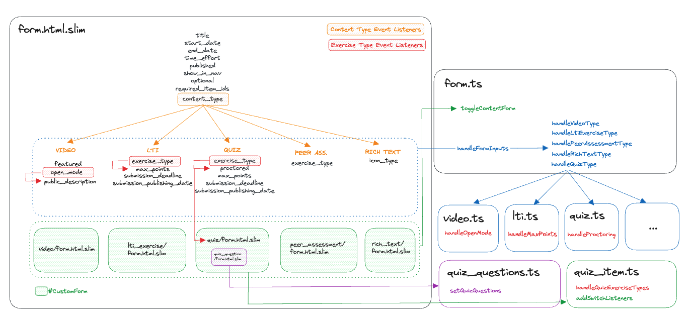

# Course items form

`app/views/items/_form.html.slim` is the form responsible for both creating and editing course items, presenting teachers with the necessary inputs based on the course item they want to create or edit.
This dynamic behavior is managed through JavaScript in `form.ts`.

## JavaScript implementation

The following diagram outlines the implementation:

### Dynamic content handling

`form.ts` manages the dynamic display of content-specific inputs in `app/views/items/_form.html.slim`.
Based on the `content_type` value (`quiz`, `form`, `video`, `lti`, `rich_text` or `peer_assessment`), `handleFormInputs` toggles the visibility of some form inputs.

The custom form content (`#custom-form`) is also dynamically adjusted using the `toggleContentForm` function.
This function selects the appropriate template from `app/views/items/_form_wrapper.html.slim` and appends it to the `#custom-form` element.

In edit mode the content type is fixed, allowing the corresponding custom form to be added on the server side.

### Event listeners

Additional event listeners are attached to the `exercise_type` input (for LTI exercises and quiz items) and to the `open_mode` checkbox (for video items) to respond to changes in their values.
