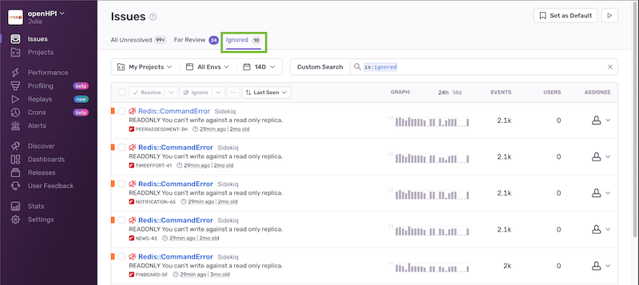
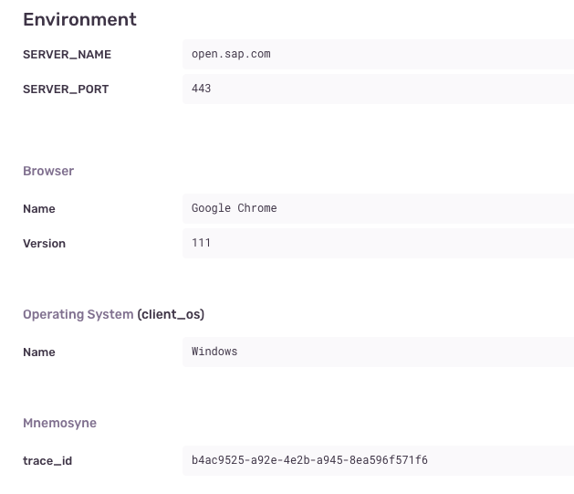
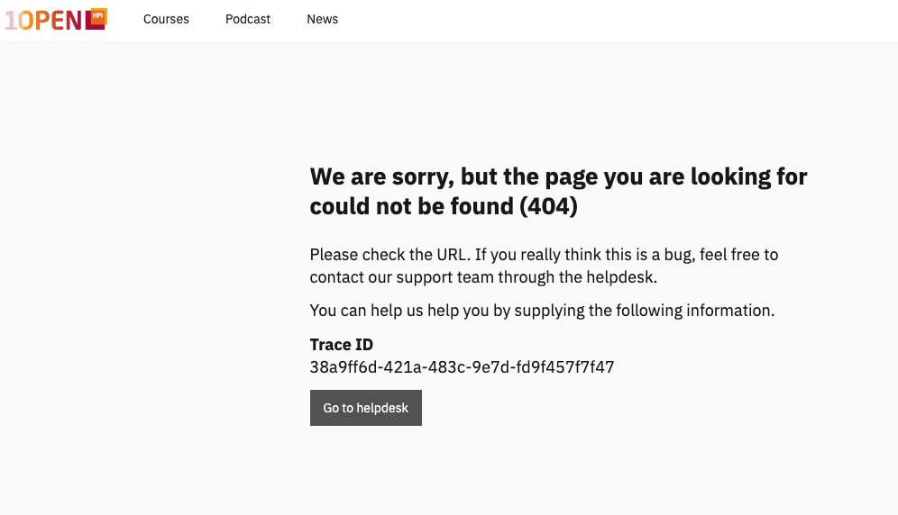
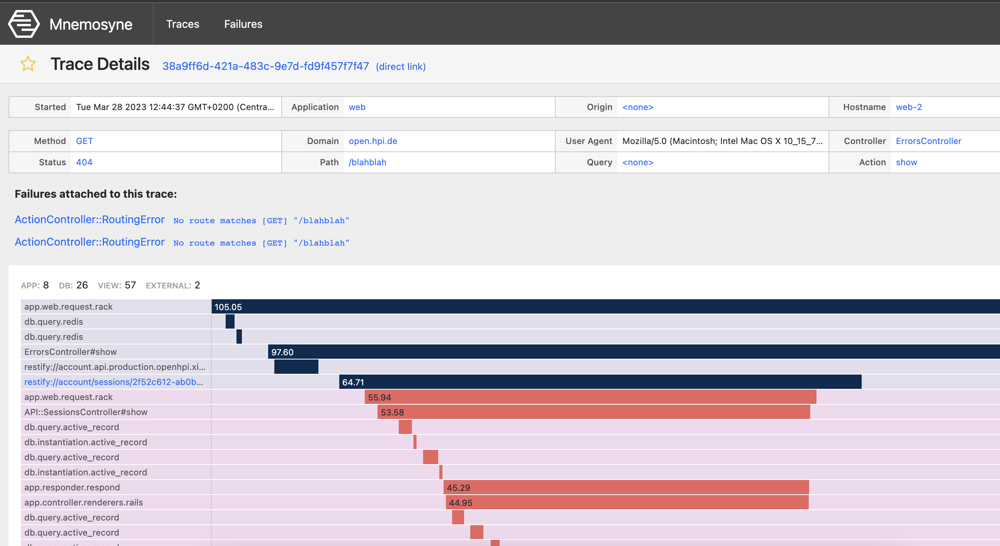

# Monitoring

## Sentry

Sentry is a tool used for monitoring, prioritizing, and debugging errors. The [dashboard](https://openhpi.sentry.io/issues/) provides real-time visibility into platform errors and it enables developers to quickly identify and resolve issues that impact application performance and user experience.

- **Error Monitoring**: Errors on our platforms are reported to Sentry, with detailed information about each error, including the stack trace, request information, and metadata. One can know in which brand the error was caused, which application (e.g web, courses, pinboard) as well as information on the client side (operating system).

An example of how our app reports errors to Sentry (as well as to Mnemosyne, see below):

```ruby
rescue Restify::ClientError => e
  ::Mnemosyne.attach_error(e)
  ::Sentry.capture_exception(e)
```

- **Prioritization**: It automatically groups similar errors together, so errors that are occurring most frequently can be prioritized accordingly.

- **Debugging**: Sentry provides detailed information about each error, making it easier to identify the root cause and fix the defect.

### Ignoring errors in Sentry

There are several reasons to set errors on Sentry to be ignored.
One common reason is to avoid being alerted about errors that are not actionable or those that cannot be fixed. This helps us avoid being overwhelmed by alerts that are not relevant.

To see the list of all errors that are currently ignored, one can go to the "Ignored" tab:



There are essentially two ways in which Sentry is set to ignore errors. One is via config.

This is a sample configuration for excluding certain exceptions:

```ruby title="config/initializers/sentry.rb"
config.excluded_exceptions += %w[
  Acfs::BadGateway
  Acfs::GatewayTimeout
  Acfs::ServiceUnavailable
  Status::NotFound
  Restify::BadGateway
  Restify::GatewayTimeout
  Restify::ServiceUnavailable
  ApplicationJob::ExpectedRetry
]
```

In Sentry, one can ignore errors by creating an ignore rule. Ignore rules allow specifying certain conditions that, when met, will cause Sentry to ignore specific errors.

To create an ignore rule, go to the "Issues" page in Sentry and click on the "Ignore" button next to the error to be ignored. From there, the conditions can be specified for which the error should be ignored. For example, one can ignore errors that contain certain keywords or that come from specific users or IP addresses.

## Relate Mnemosyne issues from Sentry

When viewing an issue in Sentry, the related Mnemosyne Trace ID can normally be found also.

In the error on Sentry, the Mnemosyne Trace ID can be found under 'show more':



## Mnemosyne

[Mnemosyne](https://dev.xikolo.de/mnemosyne/) is another monitoring system developed by us.
It extracts full application traces including cross-application requests. Therefore it does not only track errors as Sentry does but all kinds of requests. They are stored for one week.

### Copy and paste the error's Trace ID

When dealing with a helpdesk ticket or when having deliberately simulated a production error in the browser, one may use the Trace ID seen in the browser (or indeed the same number given in the case of a helpdesk ticket) to track the error. By this, it is meant that the ID can be used to look up the error as Mnemosyne records all errors sent by the application.
The advantage here is that with relatively little knowledge one can dig into an error easily.

An example of a Trace ID that can be used in Mnemosyne:



Here is what can be seen when pasting the Trace ID into Mnemosyne:



### Worthy of note

Mnemosyne also stores query parameters for requests. This can allow more explicit research and debugging in some cases.
