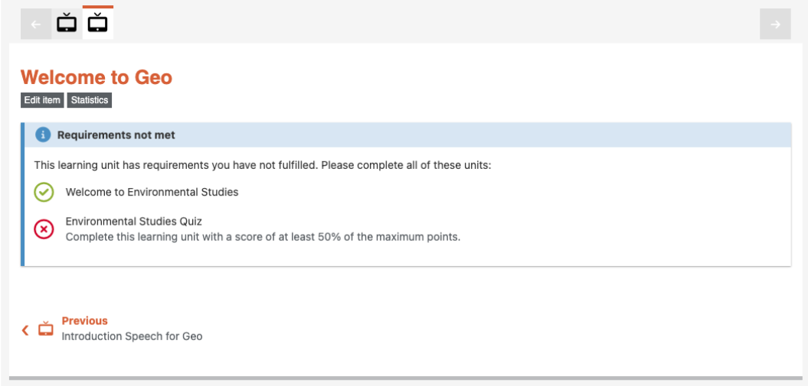

# Item features

## Item prerequisites

All item types can have (a set of) any kind of other items as prerequisites. These prerequisites are called
`required_items`. Required items can be configured using the multi-select dropdown in the item properties
admin interface.

All required items must be _fulfilled_ in order to gain access to the item with prerequisites.

Fulfillment means:

- For the content types _Text_ and _Video_: the item must have been visited at least once.
- For the assessment content types _Quiz_, _Exercise_, and _Peer Assessment_: the item must have been completed
  with a score of at least 50% (default value) of the maximum points. This percentage can be configured in
  `Xikolo.config.required_assessment_threshold` by the platform administrator.

Until all requirements are fulfilled, the learner's attempt to access a restricted item is interrupted and the
current state of the requirements and fulfillment is shown in a callout (see screenshot below). While visiting
the item without having all requirements fulfilled, no visit record is created.

Questions from quizzes with item prerequisites are always excluded from the recap questions.

The feature currently comes with a number of limitations:

- Survey quizzes cannot be required items: those items are quizzes that do not have  a score, so they can never
  be fulfilled with the current logic.
- Handling deletion of items which are required somewhere: deleting such items would result in an error for the
  item with requirements.
- Handling of locked or unpublished items: locked or unpublished items should currently not be required items,
  since they cannot be fulfilled.
