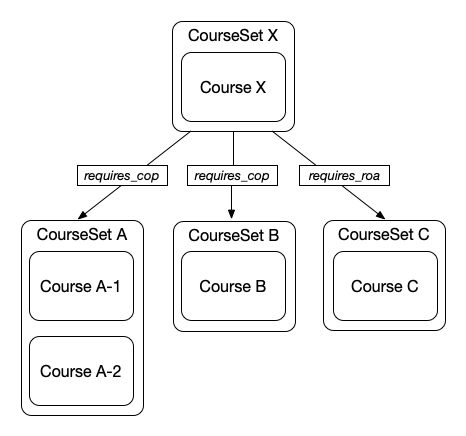

# Course relations

Course relations and the closely connected course sets are means to group courses and link those courses or course groups together. The `Course` domain mainly holds the necessary data structure, while the interpretation of these connections are implemented in the context of other business logic.

## Use cases

### Course tracks / Combined courses

"Course Tracks" or alternatively "Combined courses" revolve around **prerequisites**, where learners have to finish a set of courses before accessing the content of another course. "Finishing a course" can either require the Confirmation of Participation or the Record of Achievement, based on the configuration (i.e. the kind of the respective course relation). A prerequisite in a course can also be configured with a "one out of X" option, e.g. if you allow different iterations of a course as equal prerequisite candidates.

!!! example

    

    Course X is a course with 3 requirements. To be able to enroll, a user needs

    - a Confirmation of Participation in Course A-1 **or** Course A-2
    - **and** a Confirmation of Participation in Course B
    - **and** a Record of Achievement in Course C

All of a course's prerequisites will be listed on that course's details page.

### Future use cases

- Language variants / Translations
- Course iterations
- Recommended courses
- and more...

## Resources

**Course Sets** are a simple data structure identified by a name and holding a number of courses (*course set entries*) that "belong together" in the context of a course relation.

**Course Relations** (actually `CourseSetRelations`) define directed connections between course sets. They need a *source* and a *target set* as well as a *kind*. Course relations only work with course sets, not with single courses. Though, a course set can consist of only one course.
